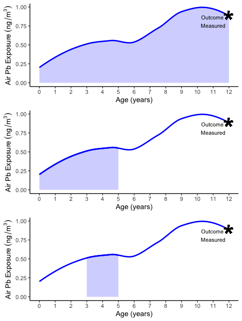
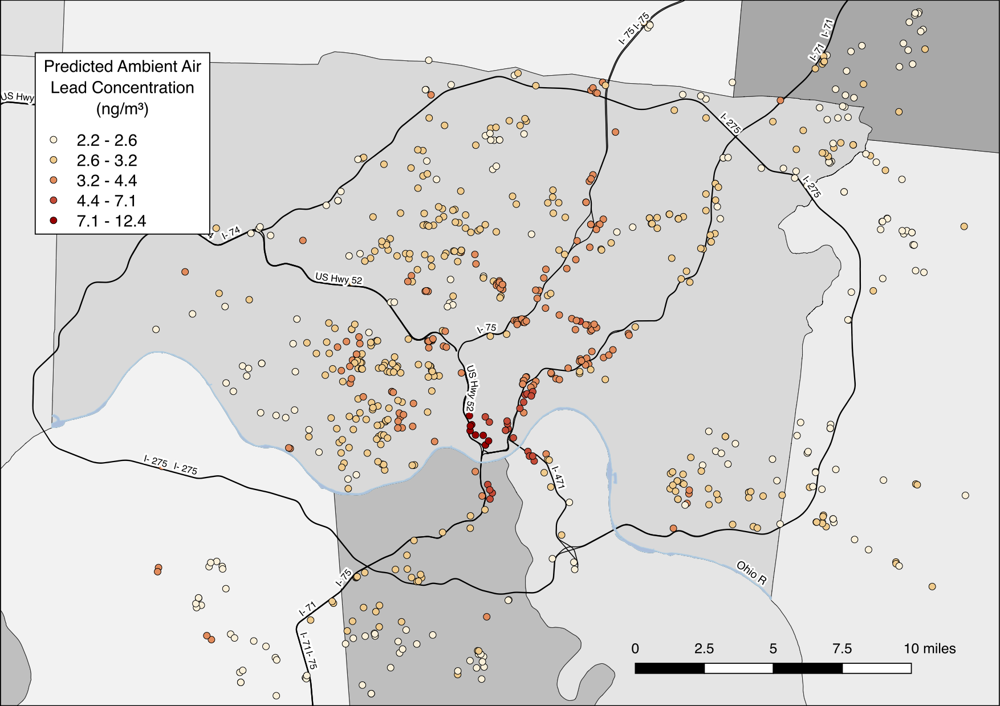
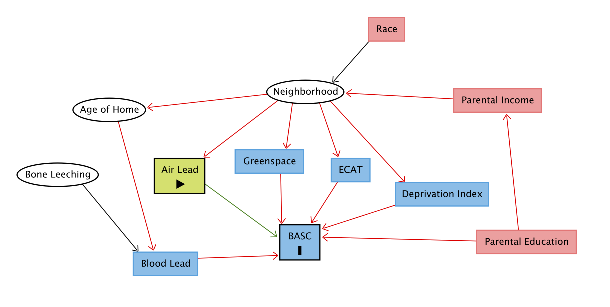
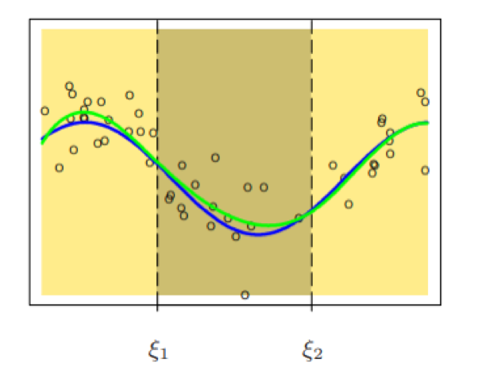
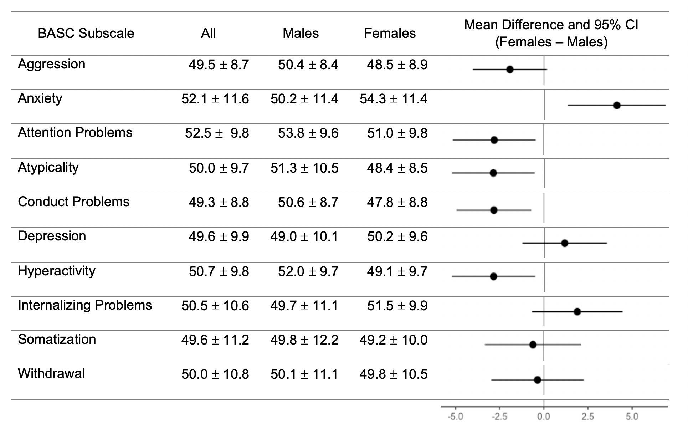
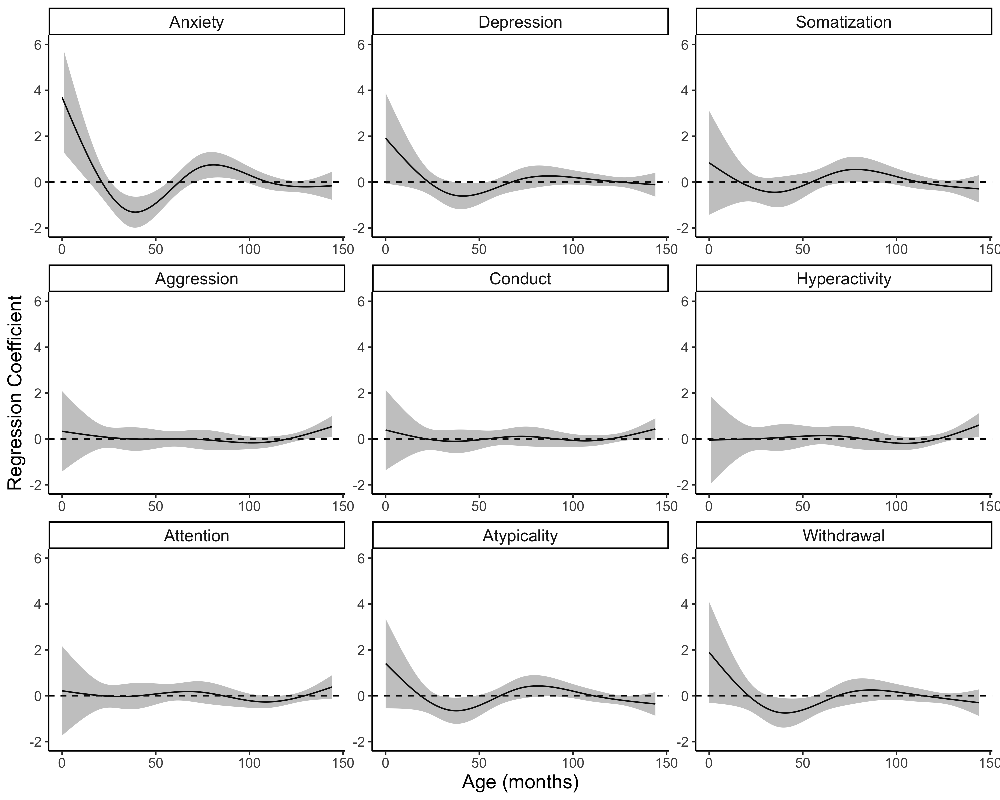
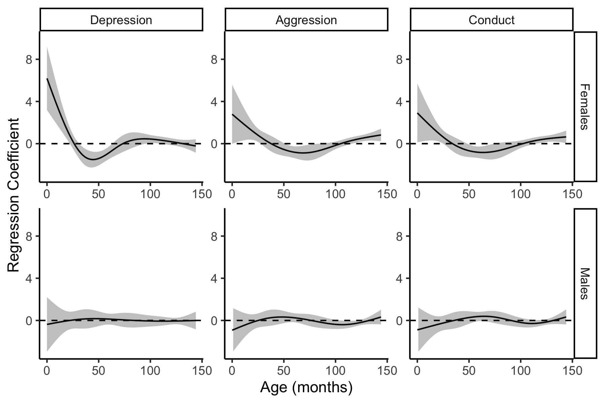

```{r setup, include=FALSE}
options(htmltools.dir.version = FALSE)
knitr::opts_chunk$set(echo = FALSE, message=FALSE, warning=FALSE)
```

```{r, include=FALSE}
library(knitr)
library(kableExtra)
library(tidyverse)
```


# Neurotoxic Effects of Lead Exposure

- Decades of research support the association between blood lead levels and neurocognitive and neurobehavioral deficits, often even at blood lead levels below the CDC reference level of 5 $\mu g/dL$.

- Cognitive, intellectual, and behavioral deficits in children:

    + Decreased scores on end-of-grade reading exams
    
    + IQ deficits
    
    + Increased hyperactivity and impulsive behaviors
    
- Effects of childhood lead exposure lasting into adulthood:  
    
    +  Decreased gray matter in regions of the brain associated with executive functions, mood regulation, and decision-making
    
    + Association with higher rates of arrests for all offenses and violent offenses

---

# Lead Exposure Pathways

- Ingestion

    + Deterioration of lead-based materials, such as paint
    
    + Hand-to-mouth contact, contaminated food or drink
    
- Remobilization of lead deposited in the bones

    + Maternal lead deposited into bones during development
    
    + Leach into the body during entire lifecourse
    
- Inhalation

    + Nearby stationary sources (i.e., industrial facilities)
    
    + Ambient levels due to mobile sources (i.e., traffic-related air pollution)
    
    + U.S. EPA National Ambient Air Quality Standard (NAAQS) threshold of 150 $ng/m^3$ not to be exceeded as a rolling three-month average
    
---

# Measuring Exposure to Lead

- Blood Lead

    + Representative of mostly ingested lead (70%) and lead leached from the bones
    
    + Only 3% of lead in blood is due to inhalation
    
- Air Sampling

    + Difficult to measure concentrations of lead that may travel to brain through airway
    
    + Measure levels of lead in air surrounding area of interest, such as the home
    
    + Health effects specifically associated with airborne lead exposure can be overlooked if only measure of exposure is blood lead level

---

# Sensitive Windows of Exposure

.pull-left[
- Most studies assess exposure at one time point or average exposure over a period of time.

- If time and developmental window chosen for study is not time at which children are most sensitive to the exposure, could miss or underestimate effects. 
]

.pull-right[

]

---

# Study Population

- Cincinnati Childhood Allergy and Air Pollution Study (CCAAPS)

- Prospective birth cohort of children born October 2001 to July 2003 in the Greater Cincinnati metropolitan region. 

- Study eligibility required:

    + Having a birth record address either farther than 1,500m or less than 400m from a major highway
    
    + Having at least one biologic parent with allergic sensitization verified by skin prick testing

---

# Airborne Pb Exposure Assessment

<style>
.verticalcenter {
    display: table-cell;
    height: 400px;
    vertical-align: middle;
}
</style>

.pull-left[
- Estimates of ambient Pb concentrations from a previously validated exposure assessment model (cross-validated accuracy <br> pseduo- $R^2$ = 0.89)

- Land use random forest (LURF) model based on ambient air sampling conducted in the study area at 24 sites from 2001 to 2005

- Land use predictors such as land cover measurements, bus routes, greenspace, population density

- LURF model used to estimate airborne Pb concentrations 
] 

.pull-right[
<div class="verticalcenter">
  
</div>
]

---

# Temporal Scaling of Airborne Pb Exposures

- To account for temporal variability in airborne Pb levels, scaled LURF estimates using air quality (AQS) measurements from EPA

- Constructed scaling factors from air Pb measurements derived from total PM measured every 3 to 6 days at EPA monitoring stations centrally located in our study area

- One scaling factor for each month of each participant's life, from birth through twelfth birthday: monthly air Pb divided by average air Pb from 2001 to 2005

- Multiplied scaling factor by corresponding annual air Pb estimate from LURF model

**Example**

birthdate: October 9, 2001

$$
\small
\frac{EPA\ avg\ Pb\ Oct.\ 9\ to\ Nov.\ 9} {EPA\ avg\ Pb\ 2001\ to\ 2005}\ *\ Age\ 1\ LURF\ Estimate\ =\ Month\ 1\ Pb\ Estimate
$$

---

# Child Behavioral Assessment

- BASC-2 (Behavioral Assessment for Children, Parent Rating Scale, 2nd edition) completed by CCAAPS parents at 12-year visit

- Assess behavioral and emotional status of children and young adults in community and home settings, and aid in clinical diagnoses of behavioral and emotional disorders

- Population normalized t-scores, with higher scores being related to more problematic behaviors. A score of 59 or greater is used to identify a clinically significant problematic behavior. 

<br>

```{r, echo=FALSE}
tribble(~`Internalizing Behaviors`, ~`Externalizing Behaviors`, ~`Other Behavioral Problems`,
                      "Anxiety", "Aggression", "Attention Problems",
                      "Depression", "Hyperactivity", "Atypicality",
                      "Somatization", "Conduct Problems", "Withdrawal") %>% 
  kable(align = "c") %>% 
  kable_styling(full_width = FALSE)
```

---

# Confounding Pathways



---

# Confounding Pathways

- **Maternal education level**

    + Reported at age 1 visit
    
    + High school degree or less or trade school, some college, college or graduate school

- **Blood lead level at age 12**

    + Accounts for lead exposure from sources other than air pollution

- **Community deprivation**

    + Index based on 6 socioeconomic census tract-level measures

- **Residential greenspace**

    + NDVI within 400 m of the home

- **Elemental carbon attributable to traffic (ECAT) exposure**

    + Accounts for non-lead air pollution

---

# Statistical Modeling: Multiple Linear Regression

$$Y_i = \beta_0 + \beta_1x_{i1} + \beta_2x_{i2} + ... + \beta_{144}x_{i144} + \varepsilon_i$$

where each $x_{ij}$ is the estimate of air Pb exposure during month $j$ of life for participant $i$ 

- A sensitive window would be defined as the period of exposure in which the 95% confidence interval(s) for the corresponding coefficient(s) do not include zero. 

**Drawbacks**

- Exposure in consecutive months likely to be correlated, resulting in unreliable standard errors, and therefore confidence intervals

- Requires estimation of 145 $\beta$ terms

---

# Statistical Modeling: Distributed Lag Models (DLMs)

- In general, DLMs predict current values of an outcome based on current and past ("lagged") values of an exposure

- Defines a third "lag" dimension

- Flexibility to model different exposure-response relationships, as well as different time-response relationships

- Can use this concept to deal with the collinearity problem caused by correlated exposures by requiring model coefficients to lie on some curve

---

# Statistical Modeling: Using Splines to Restrict DLM Coefficients

Recall the multiple regression model: $\small Y_i = \beta_0 + \beta_1 x_{i1} + \beta_2 x_{i2} + ... + \beta_{144} x_{i144} + \varepsilon_i$

We can impose additional form on each $\beta$ coefficient such that it follows the form of a natural spline. 


.pull-left[
$$
\beta_j = \theta_1 +\theta_2j + \theta_3N_3(j) + \theta_4N_4(j)
$$


where $\small N_1(x) = 1, N_2(x) = x,$

$\small N_{k+2}(x) = d_k(x) - d_{K-1}(x),$

$\small d_k(x) = \frac{(x - \xi_k)^3_+ - (x - \xi_K)^3_+} {\xi_K - \xi_k}$ , 

and $k$ is the number of knots $1, ..., K$
] 


<style>
.aligncenter {
    text-align: center;
    vertical-align: middle;
}
</style>

.pull-right[
<div class=".aligncenter">
  
</div>
<span style="font-size:0.4em; color:gray">
Hastie, Tibshirani, and Friedman. The Elements of Statistical Learning. Page 143.
</span>
]

---
# Statistical Modeling: Using Splines to Restrict DLM Coefficients

Recall the multiple regression model: $\small Y_i = \beta_0 + \beta_1 x_{i1} + \beta_2 x_{i2} + ... + \beta_{144} x_{i144} + \varepsilon_i$

We can impose additional form on each $\beta$ coefficient such that it follows the form of a natural spline. 

$$
\beta_j = \theta_1 +\theta_2j + \theta_3N_3(j) + \theta_4N_4(j)
$$

Then we can substitute the function for each $\beta_j$ into the multiple regression equation, and rearrange algebraically.

Now we can estimate 4 $\theta$ terms instead of 145 $\beta$ terms. The 4 $\theta$ estimates can then be substituted back into the equation to estimate the $\beta$ coefficients corresponding to each lag.

---

# Model for Identifying Sensitive Pb Exposure Windows for BASC Outcomes

$$\small Subscore_i = \alpha_0 + \sum_{j=0}^{144} \beta_j x_{ij} + \alpha_1 MaternalEducation_i + \alpha_2 BloodLead_i + \\ \small \alpha_3 Deprivation_i + \alpha_4 Greenspace_i + \alpha_5 ECAT_i + \varepsilon_i$$

where each where each $x_{ij}$ is the estimate of air Pb exposure for child $i$ in month $j$ of life, and there are additional constraints such that coefficients $\beta_j$ follow the form of a natural spline with 3 interior knots. The number of knots was chosen using AIC.

We tested whether or not the exposure-lag-response relationship differed among males and females by conducting an ANOVA. If the p-value was less than 0.05, we performed sex-stratified DLMs.

Estimated coefficients $\beta_j$ represent the change in BASC score associated with a 1 $\small ng/m^3$ increase in airborne lead during each month of life $j$. A sensitive window is defined as any month(s) in which the 95% confidence interval for the coefficient excluded zero.

---

# Results: Cohort Description

<br>

```{r, echo=FALSE}
d_lead <- readRDS("d_lead_final.Rds")
```

```{r, echo=FALSE}
allN <- d_lead %>% 
  select(ndvi, dep_ind, ecat, bloodPb, parent_educ, male) %>% 
  summarize(N = n())

allEduc <- d_lead %>% 
  select(ndvi, dep_ind, ecat, bloodPb, parent_educ, male) %>% 
  group_by(parent_educ) %>% 
  summarize(N = n()) %>% 
  mutate(prop = substr(paste0(round(N/263,2), "%"),3,5)) %>% 
  select(-N) %>% 
  spread(parent_educ, prop)

allMeans <- d_lead %>% 
  select(ndvi, dep_ind, ecat, bloodPb, parent_educ, male) %>% 
  summarize(ndvi_avg = mean(ndvi), 
            dep_avg = mean(dep_ind),
            ecat_avg = mean(ecat), 
            bloodPb_avg = mean(bloodPb),
            ndvi_sd = sd(ndvi),
            dep_sd = sd(dep_ind),
            ecat_sd = sd(ecat),
            bloodPb_sd = sd(bloodPb)) %>% 
  mutate_at(vars(ndvi_avg:bloodPb_sd), round, digits=2) %>% 
  mutate_at(vars(ndvi_avg:bloodPb_sd), str_pad, width=4, side="right", "0") %>% 
  transmute(`Greenspace (NDVI -1 to 1)` = paste0(ndvi_avg, " (", ndvi_sd, ")"),
            `Deprivation Index (0 to 1)` = paste0(dep_avg, " (", dep_sd, ")"),
            `ECAT (ug/m3)` = paste0(ecat_avg, " (", ecat_sd, ")"),
            `Blood Lead (ug/dL)` = paste0(bloodPb_avg, " (", bloodPb_sd, ")")
         )
  
allAirPb <- d_lead %>% 
  select(id, lag0:lag144) %>% 
  gather(lag0:lag144, key="lag", value="air_pb") %>% 
  summarize(avg_airPb = mean(air_pb), 
            sd_airPb = sd(air_pb),
            med_airPb = median(air_pb), 
            iqr_airPb = IQR(air_pb)) %>% 
  mutate_at(vars(avg_airPb:iqr_airPb), round, digits=2) %>% 
  mutate_at(vars(avg_airPb:iqr_airPb), str_pad, width=4, side="right", "0") %>% 
  transmute(`Monthly Air Lead (ng/m3)` = paste0(avg_airPb, " (", sd_airPb, ")"),
            `Median (IQR) Monthly Air Lead (ng/m3)`=  paste0(med_airPb, " (", iqr_airPb, ")"))

# d_lead %>% 
#   select(id, lag0:lag144) %>% 
#   gather(lag0:lag144, key="lag", value="air_pb") %>% 
#   summarise(max = max(air_pb))

incl_cov <- cbind(allN, allEduc, allMeans, allAirPb)
incl_cov <- select(incl_cov, N, `1`:`3`, `Greenspace (NDVI -1 to 1)`:`Blood Lead (ug/dL)`, `Median (IQR) Monthly Air Lead (ng/m3)`)
colnames(incl_cov)[2:4] <- c("High School or Less", "Some College", "College/Graduate School")
incl_cov <- t(incl_cov)
```

```{r}
maleN <- d_lead %>% 
  filter(male == 1) %>% 
  select(ndvi, dep_ind, ecat, bloodPb, parent_educ, male) %>% 
  summarize(N = n())

maleEduc <- d_lead %>% 
  filter(male == 1) %>% 
  select(ndvi, dep_ind, ecat, bloodPb, parent_educ, male) %>% 
  group_by(parent_educ) %>% 
  summarize(N = n()) %>% 
  mutate(prop = substr(paste0(round(N/141,2), "%"),3,5)) %>% 
  select(-N) %>% 
  spread(parent_educ, prop)

maleMeans <- d_lead %>% 
  filter(male == 1) %>% 
  select(ndvi, dep_ind, ecat, bloodPb, parent_educ, male) %>% 
  summarize(ndvi_avg = mean(ndvi), 
            dep_avg = mean(dep_ind),
            ecat_avg = mean(ecat), 
            bloodPb_avg = mean(bloodPb),
            ndvi_sd = sd(ndvi),
            dep_sd = sd(dep_ind),
            ecat_sd = sd(ecat),
            bloodPb_sd = sd(bloodPb)) %>% 
  mutate_at(vars(ndvi_avg:bloodPb_sd), round, digits=2) %>% 
  mutate_at(vars(ndvi_avg:bloodPb_sd), str_pad, width=4, side="right", "0") %>% 
  transmute(`Greenspace (NDVI -1 to 1)` = paste0(ndvi_avg, " (", ndvi_sd, ")"),
            `Deprivation Index (0 to 1)` = paste0(dep_avg, " (", dep_sd, ")"),
            `ECAT (ug/m3)` = paste0(ecat_avg, " (", ecat_sd, ")"),
            `Blood Lead (ug/dL)` = paste0(bloodPb_avg, " (", bloodPb_sd, ")")
         )
  
maleAirPb <- d_lead %>% 
  filter(male == 1) %>% 
  select(id, lag0:lag144) %>% 
  gather(lag0:lag144, key="lag", value="air_pb") %>% 
  summarize(avg_airPb = mean(air_pb), 
            sd_airPb = sd(air_pb),
            med_airPb = median(air_pb), 
            iqr_airPb = IQR(air_pb)) %>% 
  mutate_at(vars(avg_airPb:iqr_airPb), round, digits=2) %>% 
  mutate_at(vars(avg_airPb:iqr_airPb), str_pad, width=4, side="right", "0") %>% 
  transmute(`Monthly Air Lead (ng/m3)` = paste0(avg_airPb, " (", sd_airPb, ")"),
            `Median (IQR) Monthly Air Lead (ng/m3)`=  paste0(med_airPb, " (", iqr_airPb, ")"))

male_cov <- cbind(maleN, maleEduc, maleMeans, maleAirPb)
male_cov <- select(male_cov, N, `1`:`3`, `Greenspace (NDVI -1 to 1)`:`Blood Lead (ug/dL)`, `Median (IQR) Monthly Air Lead (ng/m3)`)
colnames(male_cov)[2:4] <- c("High School or Less", "Some College", "College/Graduate School")
male_cov <- t(male_cov)
```

```{r}
femaleN <- d_lead %>% 
  filter(male == 0) %>% 
  select(ndvi, dep_ind, ecat, bloodPb, parent_educ, male) %>% 
  summarize(N = n())

femaleEduc <- d_lead %>% 
  filter(male == 0) %>% 
  select(ndvi, dep_ind, ecat, bloodPb, parent_educ, male) %>% 
  group_by(parent_educ) %>% 
  summarize(N = n()) %>% 
  mutate(prop = substr(paste0(round(N/122,2), "%"),3,5)) %>% 
  select(-N) %>% 
  spread(parent_educ, prop)

femaleMeans <- d_lead %>% 
  filter(male == 0) %>% 
  select(ndvi, dep_ind, ecat, bloodPb, parent_educ, male) %>% 
  summarize(ndvi_avg = mean(ndvi), 
            dep_avg = mean(dep_ind),
            ecat_avg = mean(ecat), 
            bloodPb_avg = mean(bloodPb),
            ndvi_sd = sd(ndvi),
            dep_sd = sd(dep_ind),
            ecat_sd = sd(ecat),
            bloodPb_sd = sd(bloodPb)) %>% 
  mutate_at(vars(ndvi_avg:bloodPb_sd), round, digits=2) %>% 
  mutate_at(vars(ndvi_avg:bloodPb_sd), str_pad, width=4, side="right", "0") %>% 
  transmute(`Greenspace (NDVI -1 to 1)` = paste0(ndvi_avg, " (", ndvi_sd, ")"),
            `Deprivation Index (0 to 1)` = paste0(dep_avg, " (", dep_sd, ")"),
            `ECAT (ug/m3)` = paste0(ecat_avg, " (", ecat_sd, ")"),
            `Blood Lead (ug/dL)` = paste0(bloodPb_avg, " (", bloodPb_sd, ")")
         )
  
femaleAirPb <- d_lead %>% 
  filter(male == 0) %>% 
  select(id, lag0:lag144) %>% 
  gather(lag0:lag144, key="lag", value="air_pb") %>% 
  summarize(avg_airPb = mean(air_pb), 
            sd_airPb = sd(air_pb),
            med_airPb = median(air_pb), 
            iqr_airPb = IQR(air_pb)) %>% 
  mutate_at(vars(avg_airPb:iqr_airPb), round, digits=2) %>% 
  mutate_at(vars(avg_airPb:iqr_airPb), str_pad, width=4, side="right", "0") %>% 
  transmute(`Monthly Air Lead (ng/m3)` = paste0(avg_airPb, " (", sd_airPb, ")"),
            `Median (IQR) Monthly Air Lead (ng/m3)`=  paste0(med_airPb, " (", iqr_airPb, ")"))

female_cov <- cbind(femaleN, femaleEduc, femaleMeans, femaleAirPb)
female_cov <- select(female_cov, N, `1`:`3`, `Greenspace (NDVI -1 to 1)`:`Blood Lead (ug/dL)`, `Median (IQR) Monthly Air Lead (ng/m3)`)
colnames(female_cov)[2:4] <- c("High School or Less", "Some College", "College/Graduate School")
female_cov <- t(female_cov)
```

```{r}
cov_table <- cbind(incl_cov, male_cov, female_cov)
colnames(cov_table) <- c("Both", "Males", "Females")
  
kable(cov_table) %>% 
  pack_rows("Maternal Education", 2, 4, label_row_css = "")
```

---

# Results: Cohort Description

```{r, eval=FALSE}
incl_basc <- d_lead %>% 
  select(id, Anxiety:Hyperactivity) %>% 
  gather(Anxiety:Hyperactivity, key="BASC Subscore", value="score") %>% 
  group_by(`BASC Subscore`) %>% 
  summarize(out_mean = mean(score), 
            out_sd = sd(score)) %>% 
  mutate(Both = paste0(round(out_mean,1), " (", round(out_sd,1), ")")) %>% 
  select(`BASC Subscore`, Both)

boys_basc <- d_lead %>% 
  filter(male==1) %>% 
  select(id, Anxiety:Hyperactivity) %>% 
  gather(Anxiety:Hyperactivity, key="BASC Subscore", value="score") %>% 
  group_by(`BASC Subscore`) %>% 
  summarize(out_mean = mean(score), 
            out_sd = sd(score)) %>% 
  mutate(Males = paste0(round(out_mean,1), " (", round(out_sd,1), ")")) %>% 
  select(`BASC Subscore`, Males)

girls_basc <- d_lead %>% 
  filter(male==0) %>% 
  select(id, Anxiety:Hyperactivity) %>% 
  gather(Anxiety:Hyperactivity, key="BASC Subscore", value="score") %>% 
  group_by(`BASC Subscore`) %>% 
  summarize(out_mean = mean(score), 
            out_sd = sd(score)) %>% 
  mutate(Females = paste0(round(out_mean,1), " (", round(out_sd,1), ")")) %>% 
  select(`BASC Subscore`, Females)

basc_table <- incl_basc %>% 
  left_join(boys_basc, by="BASC Subscore") %>% 
  left_join(girls_basc, by="BASC Subscore")
```

```{r, eval=FALSE}
basc_table$Difference <- sprintf('', basc_table$`BASC Subscore`)

kable(basc_table, format = "html") %>% 
  kable_styling(bootstrap_options = c("condensed", "basic")) %>% 
  include_graphics()
```



---

# Results: Identification of Sensitive Windows

<center>
  
</center>

---

# Results: Sex-Stratified DLMs



---

# Results: Effect Size


```{r}
effect_table <- data.frame("BASC Subscale" = c("Anxiety", "Aggression", "Hyperactivity"),
                           "Sensitive Window" = c("Birth - 1y 2m", "11y - 12y", "11y 2m - 12 y"),
                           "Peak Association" = c("Birth", "12y", "12y"),
                           "Coefficient at Peak" = c(3.7, 0.5, 0.6), 
                           "95% CI" = c("(1.4, 6.0)", "(0.1, 1.0)", "(0.1, 1.1)") )
names(effect_table) = c("BASC \nSubscale", "Sensitive \nWindow", "Peak \nAssociation", "Coefficient \nat Peak", "95% CI")

kable(effect_table, align = 'c', caption = "Males and Females") %>% 
  kable_styling(font_size = 17)
```

<br>

```{r}
effect_table <- data.frame("BASC Subscale" = c("Depression", "Aggression", "Conduct"),
                           "Sensitive Window" = c("Birth - 1y 10m", "1m - 2y 3m", "Birth - 2y"),
                           "Peak Association" = c("Birth", "1m", "Birth"),
                           "Coefficient at Peak" = c(6.2, 2.7, 2.9), 
                           "95% CI" = c("(3.2, 9.2)", "(0.0, 5.4)", "(0.1, 5.7)"))
names(effect_table) = c("BASC \nSubscale", "Sensitive \nWindow", "Peak \nAssociation", "Coefficient \nat Peak", "95% CI")

kable(effect_table, align = 'c', caption = "Females Only") %>% 
  kable_styling(font_size = 17)
```


---

# Discussion

- First study to find associations between airborne lead exposure and harmful effects on neurobehavioral health.

- We found significant associations between a range of neurobehavioral deficits at age 12 and early life exposure to airborne lead levels an **order of magnitude below the EPA NAAQS.**

- Future Work:

    + Choice of function to model time dimension
    
    + Choice of function to model exposure-response relationship (DLNMs)
    
    + Nonlinear confounders, interaction terms, lagged confounders
    
    + Replication in different cohort(s)  

---

# Thank You

<br>
<br>
<br>

<center>
Collaborators:  <br>
<br>
Patrick Ryan, A. John Bailer, Thomas Fisher, Nicholas C. Newman, <br> Kimberly Yolton, Cole Brokamp
</center>    


